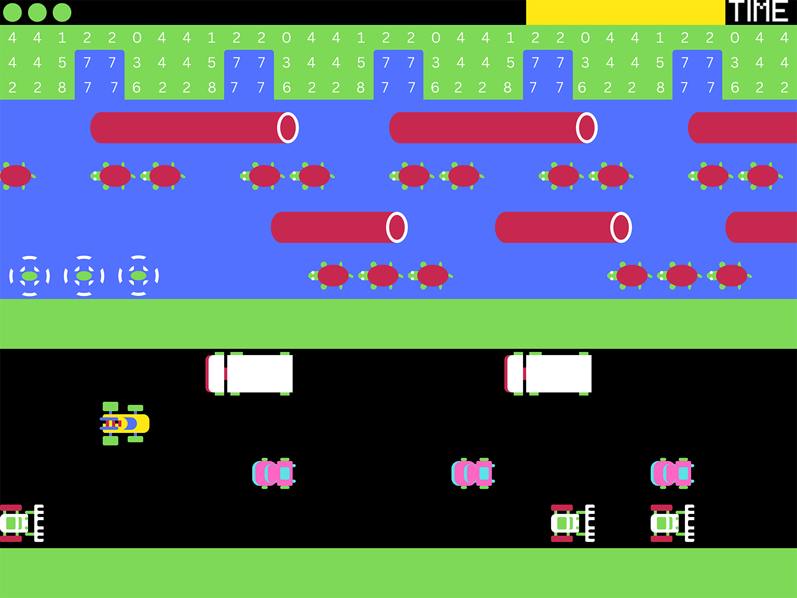

 

  <h3 align="center">Game_01</h3>
  
  

  

    Game_01

    6502 assembly language for the BBC Micro

    This is a project for testing out 6845 special effects such as vertical rupture for horizontal scrolling on different lines by different amounts, and palette changes that occur at the exact end of a horizontal line just as the blanking period starts to avoid any visible glitches.
  

