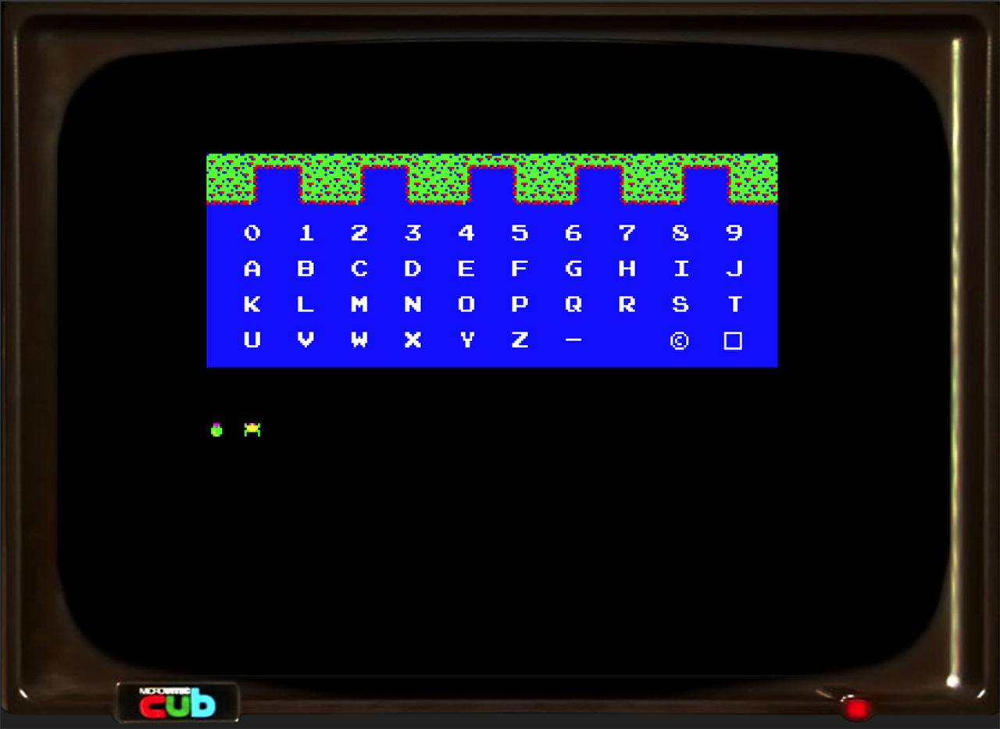
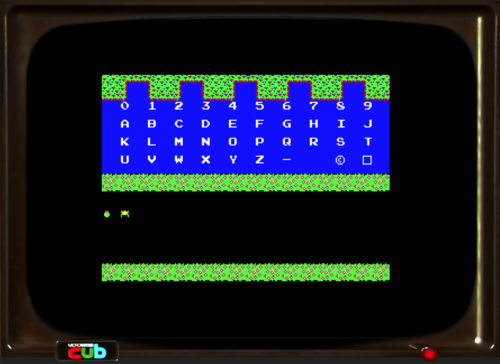

 

  <h1>Game_01</h1>
   
  
  

    Background sprite layout design
  

   
 
  

    6502 Assembly Language for the BBC Micro

    This is a project for testing out 6502 assembly code and 6845 special effects such as:
    
      - 6845 Custom graphics mode with 256 x 192 pixels and 2-bit colour
      - 6845 Vertical Rupture for horizontal scrolling on different lines by different amounts
      - 6522 VIA Timing for palette changes that occur at the exact end of a horizontal line
  

  
  
  
  <a href="https://github.com/simonamoore/game_01">
    
  

 
 